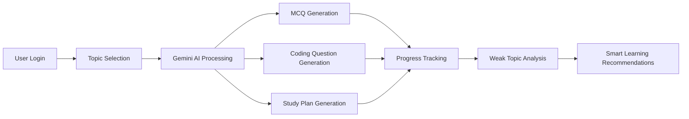

<div align="center">

# 🚀 Placement Prep AI Agent

### 🤖 AI-Powered Placement Preparation • Coding Practice • Smart Learning Assistant


---

### 🔥 AI-Powered Intelligent Placement Preparation Platform

Generate placement MCQs, coding interview questions, AI study plans, weak topic analysis, and preparation tracking using Gemini AI and smart learning workflows.

</div>

---

# 🚀 Project Highlights

✅ AI MCQ Generator  
✅ AI Coding Question Generator  
✅ AI Study Plan Generator  
✅ Weak Topic Analyzer  
✅ Progress Tracking Dashboard  
✅ LocalStorage Authentication  
✅ Smart Sidebar Navigation  
✅ Gemini AI Integration  
✅ Personalized Learning Workflow  
✅ Modern Dark Themed UI  
✅ Responsive Dashboard Architecture  
✅ AI-Powered Learning Assistant  

---

# 🧠 Placement Prep AI Workflow



---

# 📸 System Preview

## 🔐 Authentication System

> Secure localStorage-based login and signup system


## 📝 AI MCQ Generator

> Generate placement-level MCQs with explanations and answers


## 📅 AI Study Plan Generator

> Personalized company-specific AI preparation roadmap


## 💻 Coding Question Generator

> AI-generated coding interview problems with hints and approach


## 📊 Progress Dashboard

> Monitor preparation performance and learning activity


## 🧠 Weak Topic Analyzer

> Track difficult topics and improve learning efficiency


---

# ⚡ Core Features

## 📝 AI MCQ Generator
- Placement-level MCQ generation
- AI-generated explanations
- Multiple topic support
- Smart question formatting
- Dynamic topic practice

## 📅 AI Study Planner
- Personalized preparation schedules
- Company-focused preparation roadmap
- Day-wise learning strategy
- AI-generated study recommendations

## 💻 Coding Question Generator
- Placement coding interview questions
- Difficulty selection:
  - Easy
  - Medium
  - Hard
- Includes:
  - Problem statement
  - Input/output format
  - Hints
  - Approach

## 🧠 Weak Topic Analyzer
- Track weak preparation areas
- Personalized topic storage
- Smart learning recommendations
- Topic practice shortcuts

## 📊 Progress Dashboard
- MCQs practiced tracking
- Study plan tracking
- Practice history
- Preparation analytics

## 🔐 Authentication System
- Login & Signup system
- Username-based profile
- LocalStorage session persistence
- Protected application workflow

---

# 🛠️ Tech Stack

| Technology | Usage |
|---|---|
| React.js | Frontend Framework |
| Vite | Fast Build Tool |
| JavaScript | Core Logic |
| Gemini AI API | AI Generation |
| LocalStorage | Authentication & Memory |
| CSS Inline Styling | UI Design |
| VS Code | Development Environment |

---

# 📁 Project Structure

```bash
placement-ai-agent/
│
├── public/
│
├── src/
│   ├── App.jsx
│   ├── gemini.js
│   ├── main.jsx
│   └── assets/
│
├── screenshots/
│
├── .env
├── package.json
├── vite.config.js
└── README.md
```

---

# ⚙️ Installation

## Clone Repository

```bash
git clone https://github.com/your-username/placement-ai-agent.git
```

---

## Navigate to Project

```bash
cd placement-ai-agent
```

---

## Install Dependencies

```bash
npm install
```

---

# 🔑 Environment Variables

Create a `.env` file:

```env
VITE_GEMINI_API_KEY=your_api_key_here
```

---

# ▶️ Run Application

```bash
npm run dev
```

---

# 🎯 Project Objectives

- Build an intelligent AI placement preparation assistant
- Improve coding and aptitude preparation efficiency
- Track preparation progress intelligently
- Simulate modern AI EdTech systems
- Create a personalized AI learning platform

---

# 🌟 Future Enhancements

- 🎤 AI Mock Interview Agent
- 📄 Resume Analyzer
- ☁️ Firebase Integration
- 🧾 PDF Export
- 📱 Mobile Responsive App
- 🧠 Multi-Agent AI Architecture
- 🎙️ Voice Interview Assistant
- 📊 Advanced Analytics
- 🌐 Cloud Deployment

---

# 👨‍💻 Developed By

<div align="center">

## Harish Ravikumar

### Electronics and Communication Engineering Student  
### AI • IoT • Automation • Intelligent Systems Enthusiast

---

### 🌐 Connect With Me

GitHub:  
https://github.com/HarishRavikumar510

LinkedIn:  
https://www.linkedin.com/in/harish-ravikumar-70509524a/

</div>

---

# ⭐ Why This Project Stands Out

Unlike traditional preparation platforms, this project combines:

- AI-Based MCQ Generation
- Personalized Study Planning
- Coding Interview Preparation
- Weak Topic Intelligence
- Smart Progress Tracking
- AI Learning Workflow
- Modern Dashboard UI
- Authentication System
- Intelligent Learning Memory

into a single integrated AI-powered placement preparation ecosystem.

---

# 📜 License

This project is developed for educational, portfolio, research, and learning purposes.

---

<div align="center">

# ⭐ If You Like This Project, Give It A Star ⭐

</div>
